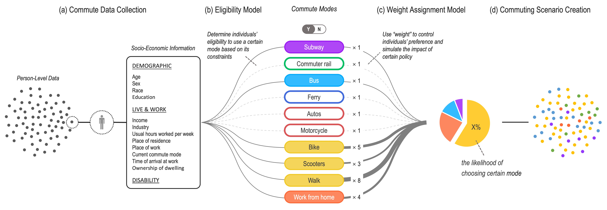
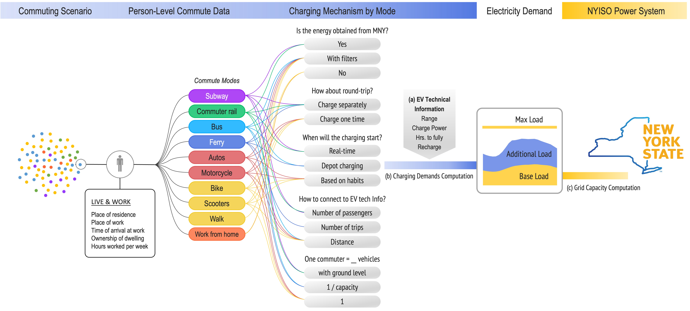

# mobility-electrification
Update - Jan 5, 2023

**Introduction** | In New York City, currently around 2 million people commute in and out of the city by car every day; only 1% of these cars are currently electric. With New York City and State leadership setting goals to achieve a carbon neutral economy within the next one or two decades, the remaining 99% commuters will soon be confronted with the decision of either substituting their gas-fueled cars for electric vehicles or switching to alternative modes of transportation such as mass transit or emerging micro-mobility technologies. This choice will have a significant impact on the ability of the city's electricity infrastructure to accommodate a fully electrified transportation sector. Building on public census data, alongside geographic information, technology specifications, and a representative simulation of the New York power system, our work visualizes this impact and provides an engaging and interactive narrative for policymakers, urban planners, and the interested public. Our quantitative results highlight the need for infrastructure investments, the usefulness of flexible charging policies and the positive impact of incentivizing micro-mobility and mass-transit options.

## Publication

J. Zhang, A. Jiang, B. Newborn, S. Kou, and R. Mieth, “[Quantifying electricity demand for 100% electrified transportation in New York City](https://arxiv.org/abs/2211.11581),” IEEE Power & Energy Society General Meeting 2023 *(under review)*

*Contact at* jingrong.zhang@nyu.edu

#### Other deliverables

Dashboard: [ https://tecnyc.herokuapp.com/ ](https://tecnyc.herokuapp.com/)

Project website / StoryMaps: https://arcg.is/WrvSf

## Workflow

This project has the following workflow.

**An example of running an entire pipeline (to create commuting scenarios) can be found [here](<05_Commuter_Electric_Pipeline/Make_Objects_For_Dashboarding_Scenarios_V3.ipynb>)**

### Part 1: Commuter Model

We model the individual mode choices and the resulting aggregate commute scenarios as depicted in Fig. 1. The model is composed of four parts: (a) commute data collection, (b) eligibility model, (c) weight assignment model, and (d) scenario creation.

You can run the code of **commuter_model.py** [here](<05_Commuter_Electric_Pipeline/commuter_model/commuter_model.py>)

### Part 2: Energy Model

Any commuting scenario will result in its own unique energy requirements given mode choices and travel distances. We propose a framework for comparing the electricity demand identified in the commuter model with the current state of the New York Independent System Operator (NYISO) power system as illustrated in Fig. 2. The Energy Model has three parts: (a) EV technical information collection, (b) charging demand computation, and (c) grid capacity computation.

You can run the code of **electrical_model.py** [here](<05_Commuter_Electric_Pipeline/electrical_model/electrical_model.py>)

## News

Runner Up, [2022 ArcGIS StoryMaps Competition for Data Visualization](https://www.esri.com/en-us/arcgis/products/arcgis-storymaps/contest/gallery/2022-winners), Issued by Esri

[Plotly & Dash 500 Index](https://dash-demo.plotly.host/plotly-dash-500/), Issued by Plotly

Longlist, [Information is Beautiful Awards](https://www.informationisbeautifulawards.com/showcase/5772-the-electric-commute-envisioning-100-electrified-mobility-in-new-york-city), Issued by Data Visualization Society

## Sources

IPUMS USA, University of Minnesota, [ www.ipums.org ](https://www.ipums.org/) 

2019 Hub Bound Travel, New York Metropolitan Transportation Council, [ www.nymtc.org ](https://www.nymtc.org/)

Load Data, New York Independent System Operator, [ www.nyiso.com ](https://www.nyiso.com/)

Power Plants & Transmission lines, Homeland Infrastructure Foundation-Level Data (HIFLD), [ https://hifld-geoplatform.opendata.arcgis.com/ ](https://hifld-geoplatform.opendata.arcgis.com/)

EV Charging Stations, Alternative Fuels Data Center, U.S. Department of Energy, [ https://afdc.energy.gov/](https://afdc.energy.gov/)

## Contributors

| Name           | Contribution                                                 |
| -------------- | ------------------------------------------------------------ |
| Jingrong Zhang | Conception of models;  Development of electricity model;  Development of dashboard and visualization;  Contributor to the manuscript;  Assisting in EV data collection (transit); |
| Amber Jiang    | Random assignment model in commuter model;  Domain knowledge and leading EV data collection;  Contributor to the manuscript; |
| Brian Newborn  | Leading commuter data collection and commuter model development;  Python OOD pipeline and commuting scenarios creation;   Contributor to manuscript;  Assisting in EV data collection (micro-mobility, transit, work-from-home); |
| Sara Kou       | Assisting in EV data collection (scooter);                   |
| Robert Mieth   | Research proposal;  Power system model;  Contributor to the manuscript and editor; Scientific advisor; |

## Additional Documentation
Development efforts are entirely now done in the 05 and 06 directories. Do not use 01,02,03,04 for any further updates. Each section has a more detailed README file that clarifies specific files being used and code ran.

[Section 1](01_DataExploration_and_Engineering/)
For our first block of work, we needed to engineer the appropriate datasets required for this work. Our first data source, [IPUMS USA](https://usa.ipums.org/usa/index.shtml), is a cleaner, easier-to-use version of existing American Community Survey data as of 2019. The ACS asks a representative sample of Americans about their lives, including demographic information and commute patterns, which are relevant to us. 

Additionally, we needed to reconcile any IPUMS counts against [NYMTC's Hub Bound Travel data](https://www.nymtc.org/DATA-AND-MODELING/Transportation-Data-and-Statistics). This report and statistics provides true counts of in/out flow into Manhattan on a typical fall business day (in 2019). Because such data is aggregated,it cannot, alone, be fuel for a commuter model. But it can serve to affirm accuracy of the IPUMS sampled data. 

[Section 2](02_DataVisualization/)
This directory was used in the Spring to manipulate the data resulting from step 1 for interim, proof-of-concept visualizations. Ultimately, data was visualized in tools outside of python for client demonstrations.

[Section 3](03_CommuterModel/)
With our data ready to use, we now took on the work of developing a workable, repeatable, well-documented Commuter Model. Cleaned data was fed into notebooks that utilized our [commuter model python class](<03_CommuterModel/tranwork_flags/commuter_model.py>). This class ingested our clean data and, after a few interim steps and adjustable parameters, assigned modes of transit to each person in our dataset. This directory was where we built our first versions of this model for testing, review, and early interim visualizations.

[Section 4](04_ElectricalInfrastructureModel/)
After building a commuter model, we needed to understand the electricity demands of each possible iteration of commuter distribution by mode, by hour, and by origin. This directory features our work developing an [electric model python class](<04_ElectricalInfrastructureModel/electrical_model.py>). This file distributes electricity demand based on certain input parameters and the commuter model output it is measuring. Any two commuter model runs should have different outputs and therefore unique electricity demand profiles.

[Section 5](05_Commuter_Electric_Pipeline/)
This work is where our final development work is housed - combining efforts from steps 3 and 4, we house the latest and only versions of our models that should be used here. Then, we have notebooks showing how we ran these models concurrently to develop pickle files that would be fed into our final visualization.

[Section 6](06_Dashboard_Visualization/)
This houses our final deliverable - our interactive dashboard. THe goal of this is to show how when one changes certain input parameters about commuting patterns, the electricity demand on Manhattan's grid will adjust. This visualization is developed using plotly, and all of its code is housed here.

Link to readme within this section that explains in more detail what we have done